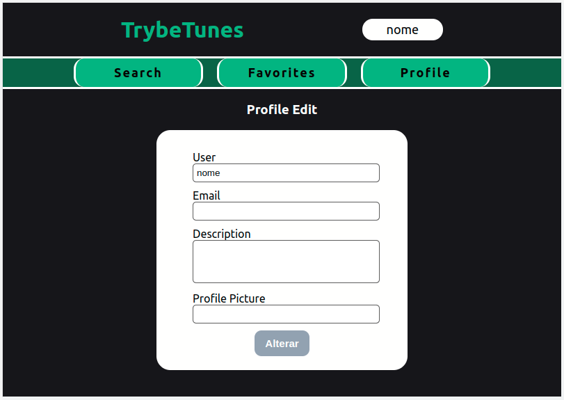

# Music App - Trybetunes

## What is this project?
TubeTunes is a project that I made as a student of the Trybe Web Development School, in here you can see all the code I did to achieve 100% approval!
All the code was made using React.

---

## In this App you can:
  -  In the Login page, you must type your name to gain access;
  -  In the Search page, you can search for any artist you want;
  -  Clicking on any card that appers, will redirect you to an Album page, with a preview of the songs, you can also add then to your favorites list;
  -  In the Favorites page, you can see all you favotite songs and remove then;
  -  In the Profile page, you can see your profile and go to the Profile Edit page, where you can edit your name, email, picture and description;

---

## Note
At this point of the course, the classes of React Testing Library and Fetch Simulators still haven't been teached, so the whole treatment of API requests and tests were pre-developed by Trybe's team.
Thats why the API treatment it's not present here.

---

## Lint
The project was developed following the Clean Code standards specified by Trybe's Lint rules.

For installation and more information [click here](https://github.com/betrybe/eslint-config-trybe).

---

## Preview
| Login | Search | Album |
| --- | --- | --- |
|  |  |  |

| Favorites | Profile | Profile Edit |
| --- | --- | --- |
|  |  |  |
